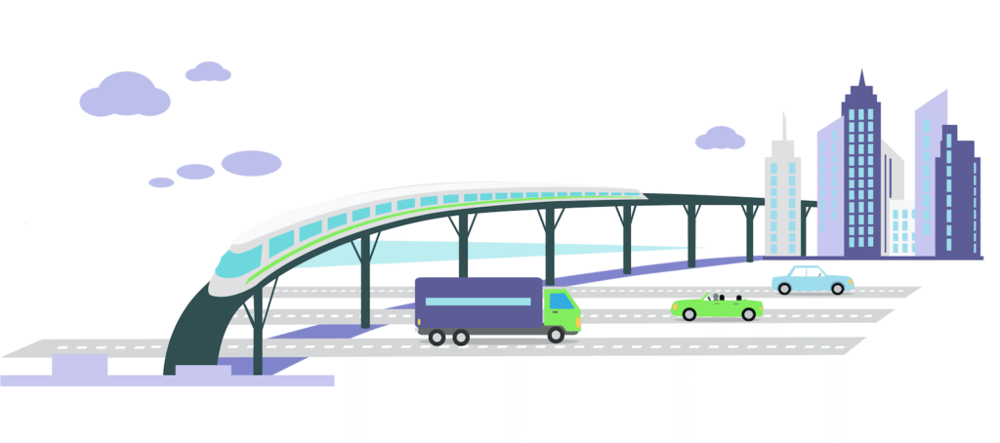

# MovilidadUrbana

Un proyecto de simulación de una ciudad con automoviles y semaforos inteligentes.

## Desarrolladores 
- [@Isabelinna](https://github.com/isabelinna)
- [@Fermi](https://github.com/A01745597)
- [@GermanGuzmanLopez](https://github.com/GermanGuzmanLopez)
- [@Yajas](https://github.com/A01745696)
- [@Alan](https://github.com/AlanSaid1)

## Implementaciones futuras
- Creacion de peatones en MESA
- Peatones en Unity

## Listo
- Implementacion de automoviles 
- Modelado en Unity
- Conexión de Mesa con Unity
